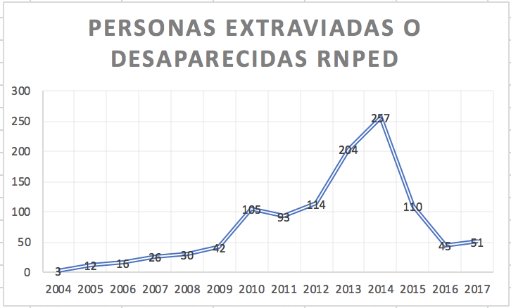

Sistema de rastreo GPS para localización de personas.
=========

## Resumen

	El presente sistema brinda una herramienta para la localización de personas por parte de terceros cercanos, de esta manera es un apoyo para adultos mayores, niños y mujeres como grupos vulnerables que son victimizados por la taza de crimen que se vive actualmente en México.

	El sistema se compone de una base de datos montada en un servidor, una aplicación web con interface gráfica, un api de servicios rest, una aplicación móvil, y un dispositivo GPS. Juntos interactuan para 

## Agradecimientos

	Agradezco a mis padres y mi hermana, a mi profesor a Dios y a la Virgen de Guadalupe.

## Introducción

### Motivación

* La desaparición de personas en México es una problematica social que se encrudeció apenas un par de años, a pesar de que ha disminuido se deben redoblar esfuerzo para que tienda a cero.

* La desaparición de los normalistas de Ayotzinapa.

* La desaparición forzada de mujeres que culminó en feminicidio.

* La desaparición de menores de edad. 

Y demás grupos sociales merecen este esfuerzo.

El RNPED (Registro Nacional de Datos de Personas Extraviadas o Desaparecidas) integra los datos de personas no localizadas obtenidos a partir de las denuncias presentadas ante la autoridad ministerial correspondiente. Este registro incluye únicamente a las personas que, a la fecha de corte, permanecen sin localizar.

Se entiende por persona desaparecida a toda aquella que, con base en información fidedigna de familiares, personas cercanas o vinculadas a ella, la hayan dado por desaparecida de conformidad con el derecho interno, lo cual puede estar relacionado con un conflicto armado internacional o no internacional, una situación de violencia o disturbios de carácter interno, una catástrofe natural o cualquier situación que pudiera requerir la intervención de una autoridad pública competente.

	

Más estadisticas:

https://www.gob.mx/sesnsp/acciones-y-programas/registro-nacional-de-datos-de-personas-extraviadas-o-desaparecidas-rnped

### Objetivos Generales y Específicos del Proyecto

#### Objetivo General

* Desarrollar un sistema que permita rastrear a los usuarios a través de una aplicación móvil, que su ubicación pueda ser almacenada en la nube y consumida por personas autorizadas.

#### Objetivo Especifico

* Implementar algoritmo Haversine para calcular la distancia entre dos coordenadas

* Implementar un API REST que alimente y/o comunique la aplicación móvil con la base de datos.

* Implementar una aplicación que permita a terceros consultar la información de la persona rastreada.

## Capitulo 1. Definición de localización

La necesidad del ser humano para lograr realizar largos viajes y hubicarse en el espacio llevo a los primeros viajeros al estudio de la cartografía.

## Capitulo 2. Implementación en la sociedad (Justificación)

La implementación de un sistema de localización en tiempo real debido a la situación de crimenes que se viven en la actualidad respecto a personas, tales como feminicidios, secuestro o robos. 

Así como su acceso de manera libre y accesible a la población.

## Fuentes

* <a href="https://www.genbetadev.com/cnet/como-calcular-la-distancia-entre-dos-puntos-geograficos-en-c-formula-de-haversine">Ejemplo Haversine 1</a> 

## Problema que dio origen al proyecto

Feminidas:

http://cedoc.inmujeres.gob.mx/documentos_download/BoletinN7_2017.pdf

Persepción inseguridad:
http://www.inegi.org.mx/saladeprensa/boletines/2017/envipe/envipe2017_09.pdf

El incremento del número de feminicidios, la desaparición forzada de periodistas, estudiantes y la creciente persepción de inseguridad en México nos motiva a crear sistemas que ayuden a la localización preventiva y a la investigación correctiva sobre la trayectoria y huella diaria de nuestros seres queridos.

## ENVIPE

ENVIPE 2016: http://www.inegi.org.mx/saladeprensa/boletines/2016/especiales/especiales2016_09_04.pdf

El Instituto Nacional de Estadística y Geografía (INEGI) presenta la Encuesta Nacional de Victimización y Percepción de la Seguridad Pública (ENVIPE).

El propósito de esta encuesta es generar información a nivel nacional, por entidad federativa y áreas metropolitanas seleccionadas sobre el fenómeno de la victimización delictiva, así como la percepción social actual respecto de la seguridad pública y el desempeño de las autoridades.

La ENVIPE permite hacer estimaciones estadísticas sobre la victimización que afecta de manera directa a las personas y a los hogares en los delitos de robo total de vehículo; robo parcial de vehículo; robo en casa habitación; robo o asalto en calle o transporte público; robo en forma distinta a las anteriores (como carterismo, allanamientos con robo en patio o cochera, abigeato); fraude; extorsión; amenazas verbales; lesiones y otros delitos distintos a los anteriores (como secuestros y delitos sexuales). 

Delitos como narcotráfico, delincuencia organizada y la trata de personas, entre otros en este tipo de categoría, no son susceptibles de medirse en una encuesta de victimización.

## Alerta Amber

## INEGI ASESINATOS

http://www.inegi.org.mx/sistemas/olap/proyectos/bd/continuas/mortalidad/defuncioneshom.asp?s=est

