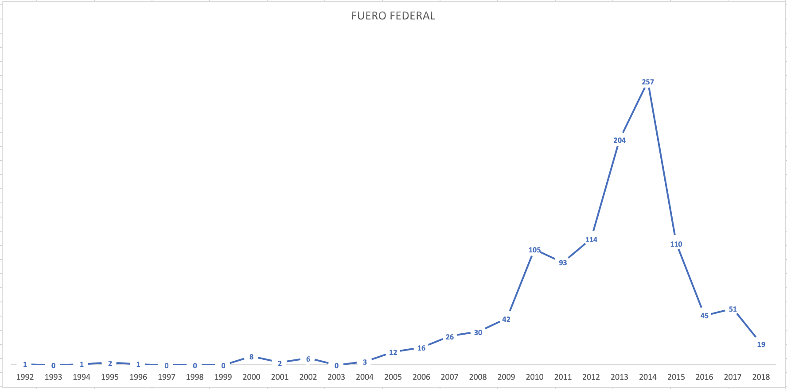
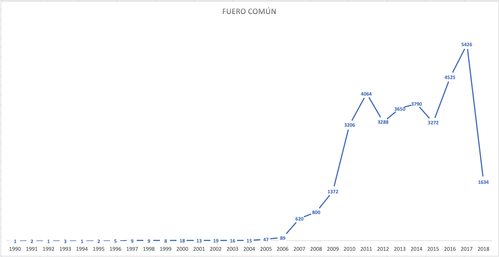
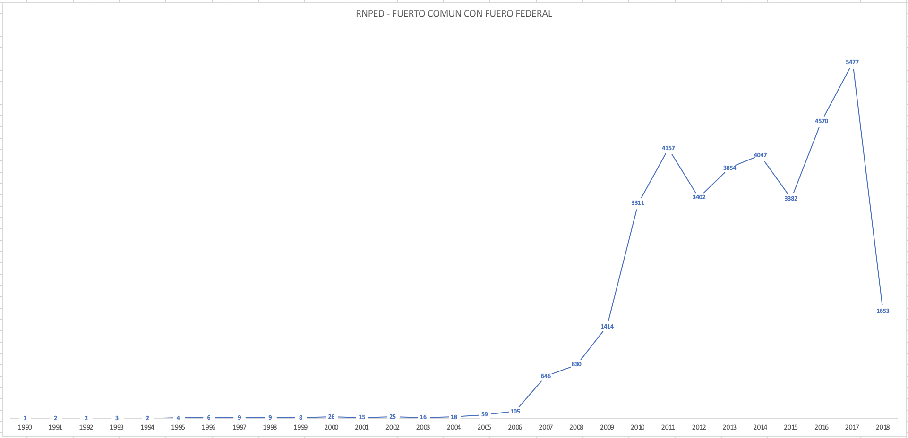
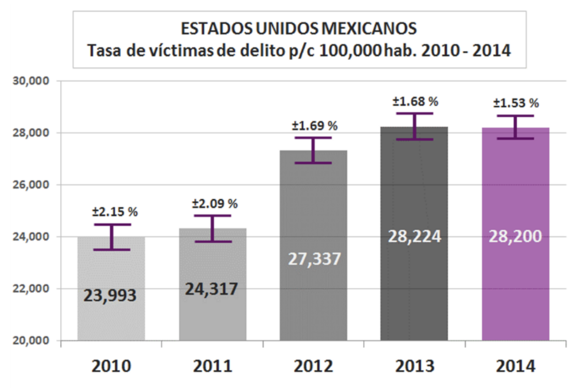
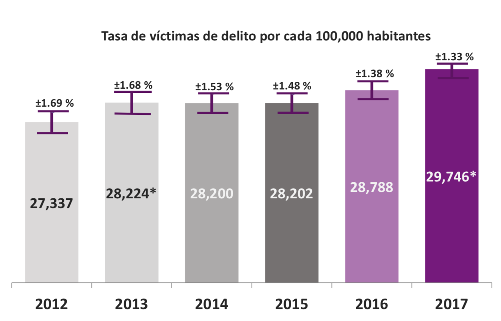

Sistema de rastreo GPS para localización de personas.
=========

## Resumen

	El presente sistema brinda una herramienta preventiva para la localización de personas debido al aumento en las tazas de desaparecidos y en general la violencia que se vive actualmente en México.

El sistema se compone de una base de datos, un api de servicios rest, una aplicación móvil y un dispositivo GPS. Juntos interactuan para mantener un historial de la ubicación del usuario.

De esta manera logramos hallar en tiempo real a la persona así como, trazar una ruta actual, que incremente las posibilidades de llevarnos a su paradero, en caso de extravio.

## Introducción

### Motivación

#### Personas desaparecidas en México 2018

* La desaparición de personas en México es una problematica social que se ha encrudeció en años recientes. El Registro Nacional de Datos de Personas Extraviadas o Desaparecidas, RNPED, integra los datos de personas NO localizadas en México, obtenidos a partir de las denuncias presentadas ante la autoridad ministerial correspondiente. Este registro incluye únicamente a las personas que, a la fecha de corte, permanecen sin localizar.

Se entiende por persona desaparecida a toda aquella que, con base en información fidedigna de familiares, personas cercanas o vinculadas a ella, la hayan dado por desaparecida de conformidad con el derecho interno, lo cual puede estar relacionado con: un conflicto armado internacional o no internacional, una situación de violencia o disturbios de carácter interno, una catástrofe natural o cualquier situación que pudiera requerir la intervención de una autoridad pública competente.

El RNPED se divide en Fuero Comun y Fuero Federal.

En concreto, cuando se dice fuero federal se refiere a la correspondencia de aplicación de leyes federales, en un caso concreto a delitos cometidos en territorio que se considera federal o delitos que se encuentran tipificados en los ordenamientos federales como el Código Federal de Procedimientos Penales, como la Ley de Amparo, la Ley Agraria, etc.

Y cuando se hace referencia al fuero local, se hace referencia a la aplicación territorial de las leyes locales, de las entidades federativas, como el Código Penal del Distrito Federal, Código Civil del Distrito Federal.

	

	

Ambos fueros

	

Como podemos observar en el 2017 alcanza su punto más alto en 10 años lo cual nos indica una situación preocupante. 

Nota: 

Aun que en 2018 se ve disminuido, estos datos se ven influenciados debido a que el RNPED realizo su fecha de corte el 30 de abril por motivos de delegar esta tarea a a la Comisión Nacional de Búsqueda de Personas como lo informan en su página:

<i>Se informa que el Secretariado Ejecutivo del Sistema Nacional de Seguridad Pública realizó por última ocasión la actualización de las bases de datos del Registro Nacional de Datos de Personas Extraviadas o Desaparecidas (RNPD) del fuero común y fuero federal con corte al 30 de abril.

Cabe mencionar que corresponderá a la Comisión Nacional de Búsqueda de Personas la publicación de las subsecuentes bases de datos, de conformidad con la Ley General en materia de Desaparición Forzada de Personas, Desaparición cometida por Particulares y del Sistema Nacional de Búsqueda de Personas, publicado en el Diario Oficial en noviembre de 2017.</i>

Los anteriores datos de personas desaparecidas en México realmente son alarmante por la exploción que se ha dado cómo podemos observar en la gráfica desde 2007.

### Aumento de la violencia en México

#### Homicidio en México 2018

Según datos del Instituto Nacional de Estadística y Geografía, INEGI, en la siguiente gráfica podemos observar los homicidios ocurridos en todo el territorio nacional desde el año de 1990 a 2017.

Podemos que en 2007 llega a su punto más bajo en más de 15 años con 8867 homocidios, apartir de ahí incrementa en más de un 50% respecto a 2007 llegando a su punto máximo en 2011 con 27213 homicidios (incrementando en más de un 300% en tan solo 4 años) apartir de ahí baja hasta 2014 con 20010 homicidios, volviendo a subir, para bater record en 2017 con 31174 homicidios, la cifra más alta en más de 25 años, un dato realmente alarmante y que preocupa a la sociedad en general.

	

#### Percepción Sobre Seguridad Pública 2018

Como su nombre lo indica el ENVIPE es la encuesta nacional sobre victimización y persepción sobre seguridad pública. 

Ofrece información referente al nivel de victimización y delincuencia, denuncia del delito, características de las víctimas de delito, los delitos y los daños causados, percepción sobre la inseguridad, desempeño institucional y la caracterización de los delitos en los hogares, entre otros.

Al mismo tiempo se da continuidad a la medición del grado de confianza social en las instituciones de seguridad pública y la percepción sobre su desempeño, los cambios en actividades y hábitos de las personas por temor al delito, la victimización del hogar y la victimización personal, así como a la identificación y medición de las actitudes y experiencias de las víctimas ante las instituciones de seguridad pública y de procuración de justicia.

La ENVIPE mide delitos que afectan de manera directa a las víctimas o a los hogares, tales como: Robo total de vehículo, Robo parcial de vehículo, Robo en casa habitación, Robo o asalto en calle o transporte público, Robo en forma distinta a las anteriores (como Carterismo, Allanamientos, Abigeato y Otros tipos de robo), Fraude, Extorsión, Amenazas verbales, Lesiones y Otros delitos distintos a los anteriores (como Secuestros, Delitos Sexuales y Otros delitos). 

Como podemos observar en 2017 el 29.74% de la población en México ha sido victima de algún tipo de los delitos de los ya mencionados, redondeando 3 personas de cada 10. Si la taza de violencia sigue aumentando así podriamos decir que promediando las tazas de años anteriores (0.821857143p) para 2021, 1 de cada 3 personas seran victimas de algun tipo de delito de los anteriores mencionados. Lo cual tambien es un dato preocupante.

	

	

#### Conclución

En conclución los indices de violencia y crimenes en México están en aumento, la tecnología juega un papel importante en buscar nuevas alternativas de brindar seguridad y estabilidad a la ciudadania.

Nos otros nos enfocaremos en el problema social de la desaparición de personas y como a través de una aplicación buscamos que se aminore.

Más estadisticas:

https://www.gob.mx/sesnsp/acciones-y-programas/registro-nacional-de-datos-de-personas-extraviadas-o-desaparecidas-rnped

### Objetivos Generales y Específicos del Proyecto

#### Objetivo General

* Desarrollar un sistema que permita rastrear a los usuarios a través de una aplicación móvil, que su ubicación pueda ser almacenada en la nube y consumida por personas autorizadas.

#### Objetivo Especifico

* Implementar algoritmo Haversine para calcular la distancia entre dos coordenadas

* Implementar un API REST que alimente y/o comunique la aplicación móvil con la base de datos.

* Implementar una aplicación que permita a terceros consultar la información de la persona rastreada.

## Capitulo 1. Definición de localización

La necesidad del ser humano para lograr realizar largos viajes y hubicarse en el espacio llevo a los primeros viajeros al estudio de la cartografía.

## Capitulo 2. Implementación en la sociedad (Justificación)

La implementación de un sistema de localización en tiempo real debido a la situación de crimenes que se viven en la actualidad respecto a personas, tales como feminicidios, secuestro o robos. 

Así como su acceso de manera libre y accesible a la población.

## Fuentes

* <a href="https://www.genbetadev.com/cnet/como-calcular-la-distancia-entre-dos-puntos-geograficos-en-c-formula-de-haversine">Ejemplo Haversine 1</a> 

## Problema que dio origen al proyecto

Feminidas:

http://cedoc.inmujeres.gob.mx/documentos_download/BoletinN7_2017.pdf

Persepción inseguridad:
http://www.inegi.org.mx/saladeprensa/boletines/2017/envipe/envipe2017_09.pdf

El incremento del número de feminicidios, la desaparición forzada de periodistas, estudiantes y la creciente persepción de inseguridad en México nos motiva a crear sistemas que ayuden a la localización preventiva y a la investigación correctiva sobre la trayectoria y huella diaria de nuestros seres queridos.

## ENVIPE

ENVIPE 2016: http://www.inegi.org.mx/saladeprensa/boletines/2016/especiales/especiales2016_09_04.pdf

El Instituto Nacional de Estadística y Geografía (INEGI) presenta la Encuesta Nacional de Victimización y Percepción de la Seguridad Pública (ENVIPE).

El propósito de esta encuesta es generar información a nivel nacional, por entidad federativa y áreas metropolitanas seleccionadas sobre el fenómeno de la victimización delictiva, así como la percepción social actual respecto de la seguridad pública y el desempeño de las autoridades.

La ENVIPE permite hacer estimaciones estadísticas sobre la victimización que afecta de manera directa a las personas y a los hogares en los delitos de robo total de vehículo; robo parcial de vehículo; robo en casa habitación; robo o asalto en calle o transporte público; robo en forma distinta a las anteriores (como carterismo, allanamientos con robo en patio o cochera, abigeato); fraude; extorsión; amenazas verbales; lesiones y otros delitos distintos a los anteriores (como secuestros y delitos sexuales). 

Delitos como narcotráfico, delincuencia organizada y la trata de personas, entre otros en este tipo de categoría, no son susceptibles de medirse en una encuesta de victimización.

## Alerta Amber

## INEGI HOMICIDIOS

http://www.inegi.org.mx/sistemas/olap/proyectos/bd/continuas/mortalidad/defuncioneshom.asp?s=est

	

## Agradecimientos

	Agradezco a mis padres y mi hermana, a mi profesor a Dios y a la Virgen de Guadalupe.

