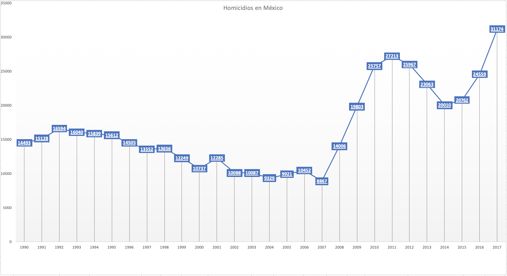

Aplicación de rastreo para localización de personas.
=========

## Resumen

<p aligno="justify">
	El presente sistema brinda una herramienta preventiva para la localización de personas debido al aumento en las tazas de desaparecidos y en general la violencia que se vive actualmente en México.
</p>

El sistema se compone de una base de datos, un api de servicios rest, una aplicación móvil y un dispositivo GPS. Juntos interactuan para mantener un historial de la ubicación del usuario.

De esta manera logramos hallar en tiempo real a la persona así como, trazar una ruta actual, que incremente las posibilidades de llevarnos a su paradero, en caso de extravio.

## Introducción

### Motivación

#### Personas desaparecidas en México 2018

* La desaparición de personas en México es una problematica social que se ha encrudeció en años recientes. El Registro Nacional de Datos de Personas Extraviadas o Desaparecidas, RNPED, integra los datos de personas NO localizadas en México, obtenidos a partir de las denuncias presentadas ante la autoridad ministerial correspondiente. Este registro incluye únicamente a las personas que, a la fecha de corte, permanecen sin localizar.

Se entiende por persona desaparecida a toda aquella que, con base en información fidedigna de familiares, personas cercanas o vinculadas a ella, la hayan dado por desaparecida de conformidad con el derecho interno, lo cual puede estar relacionado con: un conflicto armado internacional o no internacional, una situación de violencia o disturbios de carácter interno, una catástrofe natural o cualquier situación que pudiera requerir la intervención de una autoridad pública competente.

El RNPED se divide en Fuero Comun y Fuero Federal.

En concreto, cuando se dice fuero federal se refiere a la correspondencia de aplicación de leyes federales, en un caso concreto a delitos cometidos en territorio que se considera federal o delitos que se encuentran tipificados en los ordenamientos federales como el Código Federal de Procedimientos Penales, como la Ley de Amparo, la Ley Agraria, etc.

Y cuando se hace referencia al fuero local, se hace referencia a la aplicación territorial de las leyes locales, de las entidades federativas, como el Código Penal del Distrito Federal, Código Civil del Distrito Federal.

<p align="center">
	
</p>

<p align="center">
	
</p>

Ambos fueros

<p align="center">
	
</p>

Como podemos observar en el 2017 alcanza su punto más alto en 10 años lo cual nos indica una situación preocupante. 

Nota: 

Aun que en 2018 se ve disminuido, estos datos se ven influenciados debido a que el RNPED realizo su fecha de corte el 30 de abril por motivos de delegar esta tarea a a la Comisión Nacional de Búsqueda de Personas como lo informan en su página:

<i>Se informa que el Secretariado Ejecutivo del Sistema Nacional de Seguridad Pública realizó por última ocasión la actualización de las bases de datos del Registro Nacional de Datos de Personas Extraviadas o Desaparecidas (RNPD) del fuero común y fuero federal con corte al 30 de abril 2018.

Cabe mencionar que corresponderá a la Comisión Nacional de Búsqueda de Personas la publicación de las subsecuentes bases de datos, de conformidad con la Ley General en materia de Desaparición Forzada de Personas, Desaparición cometida por Particulares y del Sistema Nacional de Búsqueda de Personas, publicado en el Diario Oficial en noviembre de 2017.</i>

Los anteriores datos de personas desaparecidas en México realmente son alarmante por la exploción que se ha dado cómo podemos observar en la gráfica desde 2007.

### Aumento de la violencia en México

#### Homicidio en México 2018

Según datos del Instituto Nacional de Estadística y Geografía, INEGI, en la siguiente gráfica podemos observar los homicidios ocurridos en todo el territorio nacional desde el año de 1990 a 2017.

Podemos que en 2007 llega a su punto más bajo en más de 15 años con 8867 homocidios, apartir de ahí incrementa en más de un 50% respecto a 2007 llegando a su punto máximo en 2011 con 27213 homicidios (incrementando en más de un 300% en tan solo 4 años) apartir de ahí baja hasta 2014 con 20010 homicidios, volviendo a subir, para bater record en 2017 con 31174 homicidios, la cifra más alta en más de 25 años, un dato realmente alarmante y que preocupa a la sociedad en general.

<p align="center">
	
</p>


#### Percepción Sobre Seguridad Pública 2018

Como su nombre lo indica el ENVIPE es la encuesta nacional sobre victimización y persepción sobre seguridad pública. 

Ofrece información referente al nivel de victimización y delincuencia, denuncia del delito, características de las víctimas de delito, los delitos y los daños causados, percepción sobre la inseguridad, desempeño institucional y la caracterización de los delitos en los hogares, entre otros.

Al mismo tiempo se da continuidad a la medición del grado de confianza social en las instituciones de seguridad pública y la percepción sobre su desempeño, los cambios en actividades y hábitos de las personas por temor al delito, la victimización del hogar y la victimización personal, así como a la identificación y medición de las actitudes y experiencias de las víctimas ante las instituciones de seguridad pública y de procuración de justicia.

La ENVIPE mide delitos que afectan de manera directa a las víctimas o a los hogares, tales como: Robo total de vehículo, Robo parcial de vehículo, Robo en casa habitación, Robo o asalto en calle o transporte público, Robo en forma distinta a las anteriores (como Carterismo, Allanamientos, Abigeato y Otros tipos de robo), Fraude, Extorsión, Amenazas verbales, Lesiones y Otros delitos distintos a los anteriores (como Secuestros, Delitos Sexuales y Otros delitos). 

Como podemos observar en 2017 el 29.74% de la población en México ha sido victima de algún tipo de los delitos de los ya mencionados, redondeando 3 personas de cada 10. Si la taza de violencia sigue aumentando así podriamos decir que promediando las tazas de años anteriores (0.821857143p) para 2021, 1 de cada 3 personas seran victimas de algun tipo de delito de los anteriores mencionados. Lo cual tambien es un dato preocupante.

<p align="center">
	
</p>

<p align="center">
	
</p>

#### Conclución

En conclución los indices de violencia y crimenes en México están en aumento, la tecnología juega un papel importante en buscar nuevas alternativas de brindar seguridad y estabilidad a la ciudadania.

Nos otros nos enfocaremos en el problema social de la desaparición de personas y como a través de una aplicación buscamos que se aminore.

Más estadisticas:

https://www.gob.mx/sesnsp/acciones-y-programas/registro-nacional-de-datos-de-personas-extraviadas-o-desaparecidas-rnped

### Objetivos Generales y Específicos del Proyecto

#### Objetivo General

* Desarrollar un sistema que permita rastrear a los usuarios a través de una aplicación móvil, que su ubicación pueda ser almacenada en la nube y consumida por personas autorizadas.

#### Objetivo Especifico

* Implementar algoritmo Haversine para calcular la distancia entre dos coordenadas

* Implementar un API REST que alimente y/o comunique la aplicación móvil con la base de datos.

* Implementar una aplicación que permita a terceros consultar la información de la persona rastreada.

## Capitulo 1. Definición de localización

La necesidad del ser humano para lograr realizar largos viajes y hubicarse en el espacio llevo a los primeros viajeros al estudio de la cartografía.

## Capitulo 2. Implementación en la sociedad (Justificación)

La implementación de un sistema de localización en tiempo real debido a la situación de crimenes que se viven en la actualidad respecto a personas, tales como feminicidios, secuestro o robos. 

Así como su acceso de manera libre y accesible a la población.

## Marco Teórico

#### Aplicación Móvil

##### Capa de aplicación

Para entender este concepto hay que definir que es una aplicación.

Podemos entender una aplicación como un programa informático que permite a un usuario relalizar diversos tipos de tareas de manera transparente con capas inferiores en un sistema operativo.

La capa de aplicación se encuentra en la parte superior sobre todas las demás capas de un sistema operativo, permitiendo al usuario realizar tareas sin necesidad de conocer el funcionamiento de capas inferiores.
	
Es decir, el hardware, la unidad central de procesamiento, CPU (central processing unit), la memoria y los dispositivos de E/S (entrada/salida), proporciona los recursos básicos de cómputo al sistema. Los programas de aplicación, como son los procesadores de texto, las hojas de cálculo, los compiladores y los exploradores web, definen las formas en que estos recursos se emplean para resolver los problemas informáticos de los usuarios. El sistema operativo controla y coordina el uso del hardware entre los diversos programas de aplicación por parte de los distintos usuarios.

@
<i>
Abraham Silberschatz, Peter Baer Galvin, Greg Gagne (2006). 
FUNDAMENTOS DE SISTEMAS OPERATIVOS, 7º EDICIÓN. [en linea]. 
Madrid: McGraw-Hill/Interamericana de España, S. A. U. 
Disponible en: https://rinapilar.files.wordpress.com/2014/02/fundamentos-de-sistemas-operativos-silbertchatz.pdf [2018, 23 de octubre].
Introducción, pag 3.
</i>

En la siguiente imágen podemos observar un abstracto de la arquitectura de UNIX (sistam operativo) y sus diferentes capas.

<p align="center">
	
</p>

<i>
El sistema operativo se denomina frecuentemente el núcleo del sistema, o simplemente núcleo, para destacar su aislamiento frente a los usuarios y a las aplicaciones. Esta porción de UNIX es lo que se conocerá como UNIX en este libro. Sin embargo, UNIX viene equipado con un conjunto de servicios de usuario e interfaces que se consideran parte del sistema. Estos se puede agrupar en el Shell, otro software de interfaz, y los componentes del compilador C (compilador, ensamblador, cargador). La capa externa está formada por las aplicaciones de usuario y la interfaz de usuario al compilador C.
</i>

@	
<i>
WILLIAM STALLINGS (1997). 
SISTEMAS OPERATIVOS ASPECTOS INTERNOS Y PRINCIPIOS DE DISEÑO, 5º EDICIÓN. [en linea]. 
Pearson Educación, S.A., Madrid.
Disponible en:  
[2018, 23 de octubre].
2.6 Sistemas Unix Tradicionales, pag92.
</i>

#### Computo ubicuo.

En 1991 Mark Weiser investigador en la Computer Science Laboratory en Xerox PARC publicaba un articulo llamado "La computadora para el siglo 21".

Para Weiser existen 3 etapas de la computación:

* La era de los Mainframes o estaciones de trabajo.

* La era del computador personal.

* La era del computo ubicuo.

El computo ubicuo según Weiser, constituye la tercera ola de la computación. Básicamente es un entorno tecnológico en donde dispositivos de diferentes tamaños y funcionalidades, pueden conectarse y usarse en conjunto para manejar información, de forma que el hombre opera con mayor facilidad sus actividades del mundo cotidiano. Es decir, usar la tecnología a un nivel tan profundo que desaparezca en nuestro entorno. La tecnología profunda se tejen en el tejido de la vida cotidiana, hasta que sea indistinguible.

La gente vive sus vidas. Por lo tanto, estamos tratando de concebir una nueva forma de pensar acerca de las computadoras en el mundo, una que tenga en cuenta el entorno humano natural y permita que las mismas computadoras se desvanezcan en el fondo del ecosistema. Tal mezcla es una consecuencia fundamental no de la tecnología, sino de la psicología humana. Cuando las personas aprenden algo lo suficientemente bien, dejan de ser conscientes de ello.

La máquina multimedia de hoy, demanda la atención de la pantalla del ordenador, convirtiéndola en un foco de atención en lugar de permitir que se desvanezca en el fondo.

El sentido opuesto del computo ubicuo sería "realidad virtual" debido a que la realidad virtual se centra en un enorme aparato para simular el mundo, en lugar de mejorar de manera invisible el mundo, que ya existe.

Para explicar mejor el concepto de: "se desvance en el medio", podemos utiliza el ejemplo de "motores eléctricos dentro de un carro", están ahí al limpiar el parabrisas, al bloquear o desbloquear las puertas, pero no nos preocupamos de dónde están, sino que interactuamos de manera natural para realizar todas estas acciones. De esta manera el computo ubicuo busca que las computadoras sean invisibles.

Cientos de computadoras en una habitación suena intimidante, pero vendrán a ser invisibles a la conciencia común. La gente simplemente los usará inconscientemente para realizar tareas cotidianas.
El verdadero poder del concepto emerge de la interacción entre todos los dispositivos.

Hay más información disponible a nuestro alcance durante un paseo por el bosque que en cualquier sistema informático, sin embargo, la gente encuentra Un paseo entre árboles relajante y computadoras frustrantes. Máquinas que se adaptan al entorno humano, en lugar de obligar a los humanos a entrar en los suyos, hará que usar una computadora sea tan refrescante como pasear por el bosque.

#### Movilidad informática.

Basado los conceptos anteriores podemos deducir que la "movilidad" es la segunda era de la computación la era del "computador personal". Dónde a diferencia de los Mainframes o grandes estaciones de trabajo tenemos acceso a computadores portatiles o movibles que podemos llevar de un lado a otro y no necesariamente están fijas en un lugar como los Mainframes en la primera etapa.

La computación móvil admite: computadoras portátiles, teléfonos celulares, los cuadernos de notas computarizados, las calculadoras de bolsillo, etc. Sistema de computación en donde el usuario puede estar en movimiento. Esto consiste en fabricar computadoras suficientemente pequeñas para ser fácilmente transportadas.

En cuanto a la comunicación que las computadoras portables tienen con otros dispositivos/computadoras, el modelo de comunicación más difundido, es el modelo cliente-servidor. Mayormente usado en nuestras redes de area local e Internet.

La arquitectura cliente-servidor es un modelo de diseño de software en el que las tareas se reparten entre los proveedores de recursos o servicios, llamados servidores, y los demandantes, llamados clientes. Un cliente realiza peticiones a el servidor, quien le da respuesta.

Por lo tanto podemos decir que "la movilidad infomática" es todo dispositivo de computo portable que interactúan con información centralizada (servidor) mientas los usuarios se encuentran en diferentes ubicaciones.
	
https://es.slideshare.net/briangamarra/computacion-movil-y-ubicua-41951544?next_slideshow=1
Weiser, M. (1991). The Computer for the Twenty-First Century. Scientific American, 265, 94-110.
Mark Wiser (September 1991). The Computer for the 21st Century. [en linea] Scientific American [26 Octubre 2018]

https://es.slideshare.net/briangamarra/computacion-movil-y-ubicua-41951544?next_slideshow=1

<i>Weiser, M. (1991). The Computer for the Twenty-First Century. Scientific American, 265, 94-110.</i>

#### Aplicación Móvil

Una aplicación móvil es una herramienta digital que cumple una tarea especifica y que interactua sobre un sistema homogeneo.

Por ecosistema móvil nos referimos al conjunto de actores necesarios para poder tener los dispositivos móviles y a las aplicaciones para los mismos. En concreto, en el ecosistema móvil se incluyen las operadoras de telecomunicaciones, los fabricantes de hardware y todos los elemen- tos de software que intervienen en la ejecución de la aplicación. 

Tal ecosistema es homogeneo pasa desapersivido a simple vista, sin duda las aplicaciones móviles son el preámbulo de la computación ubicua.

Tal ecosistema es importante, pues la aplicación móvil sería la punta del iceberg, pues en realidad detras de ésta hay varios sistemas que interactuan entre si.

Aun que los lenguajes de programación en los que escribimos estas aplicaciones móviles en su mayoría son de proposito general y nos sirven tanto para back-end como para front-end, la aplicación al ser la punta de la piramide está enfocada en el front-end, en desplegar datos, consumir servicios, y trasmitir esa información a un sistema centralizado pasando a ser una extensión del mismo.

#### Clasificación de las aplicaciones móviles

Las clasificaciones de las apliaciones móviles son ampliamente diversas, todo esto se debe a la fragmentación, podemos encontrar diversos desarrolladores de hardware que soportan diversos desarrolladores de software que a su vez soportan diversos lenguajes de programación (Java, Kotlin, ObjC, Swift, Javascript), con diferentes técnicas de programación, actualmente no hay una organización que estandarice y homologue la fragmentación para fácilitar el desarrollo de las aplicaciones.

A continuación se presentan casos de fragmentación:

1. Hardware

* Tamaño
* Capacidad
* Sensores
* Procesamiento

Smart TV, Smartphone, Relojes, etc.

2. Software

* Plataforma de SO (iOS, Android)
* Versiones de una plataforma (Android 3, Android 5, etc) 

3. Desarrollo

* Lenguaje (Java o Kotlin, Objective-C o Swift)
* Versión del lenguaje (Swift 3, Swift 4)
* Librerias (Públicas, Privadas, Propias)

3. Comunicación 

* Estáticas
* Dinámicas

Las primeras no tienen comunicación externa y no cambian, las segundas tienen acceso a red y consumen servicios dependiendo de reglas de negocio y el consumo de estos servicios su desplegue de datos e interacción con el usuario varia.

Existen otras clasificaciones que escapan al uso de la ingeniería de sistemas como:

Precio, contexto social, etc.

<i>

http://openaccess.uoc.edu/webapps/o2/bitstream/10609/9582/10/Tecnolog%C3%ADa%20y%20desarrollo%20en%20dispositivos%20m%C3%B3viles_M%C3%B3dulo4_M%C3%A9todos%20para%20el%20desarrollo%20de%20aplicaciones%20m%C3%B3viles.pdf

Ramírez Vique Roberto (2011). Métodos para el desarrollo de aplicaciones móviles. FUOC. Fundació per a la Universitat Oberta de Catalunya España, Pag. 10
</i>

## GPS

## Breve introducción

* Definición.

Sistema Global de Posicionamiento GPS (Global Positioning System).

* Ventajas GPS.

1. Permite conocer la posición con un error inferior a los 100m
2. A cualquier hora, lugar o condición meteorologica
3. Permite calcular la velocidad
4. Rumbo de deslazamiento

* Historia.

El GPS es introducido en 1978 por el departamento de defensa de los Estados Unidos.
El sistema está financiado, administrado y controlado por US.

* Arquitectura.

Está compuesto por 24 satélites de radionavegación repartidos alrededor de la tierra a unos 20mil km de altura. Éstos emiten información permanente permite a cualquier receptor GPS determinar su posición durante las 24 hrs. Este sistema también cuenta con estaciones terrestres que controlan los satélites.

## Historia

Surge a partir de agrupar el proyecto 621B de la U.S. Air Force (sistema de radionavigación) con el sistema Timation desarrollado por la Naval Research Laboratory que permitiría informaciones horarias muy precisas gracias a satélites con relojes atómicos. Dando surgimiento al Navstar Global Positioning System posterioremente simplificado como GPS cuyo objetivo era reducir la vulnerabilidad de las estaciones terrestres de radionavegación y cubrir toda la tierra, así como situar la velocidad de un móvil y la hora exacta.

El "Sistema de posicionamiento global por satelite" fue introducido en 1978 por el departamento de defensa de los estados unidos

El 28 de junio de 1983 el SPS (Standard Positioning System) se hace accesible a nivel mundial para fines pacificos y civiles. Se establece su presición a 100 metros y una degradación de la presición a voluntad del ejército en caso de necesidad.
	
## Composición

Se compone de 3 elementos distintos denominados segmentos.

1. Segmento espacial. Lo componen los satélites.
2. Segmento de control. Lo componen las estaciones de control.
3. Segmento del usuario. Lo componenlos receptores GPS.

* Segmento espacial.
	
	Está formado por una constelación de 24 satélites llamados SV (Space Vehicle). Circundan la tierra a 20.2000 km de altitud y forman 6 órbitas diferentes con 4 satélites cada una.
	Cada 24 horas menos 4 minutos a causa del desplazamiento de la tierra al rededor del sol, se presenta exactamente en el mismo lugar y con la misma configuración respecto a los demás satélites.
	
	Cada satelite envia un mensaje de navegación indicando su posición orbital así como la hora exacta de la emisión de dicho mensaje.
	
* Segmento de control.

	Se conforma por 5 estaciones de vigilacia y monitorización del sistema GPS, distribuidas al rededor del planeta, incluyendo una estación principal que asegura el correcto funcionamiento del sistema calculando las correcciones a aplicar.
	
	Las cinco estaciones se encuentran en las islas: Hawaii, Kwajalein (islas Marshall), Ascensión, Diego Garcia, en Colorado Springs. Su misión es captar todas las seáles emitidas por los satélites, acumular los mensajes recibidos y transmitir todas las informaciones recogidas a la estación principal.
	
<p align="center">
	
</p>
	
* Segmento del usuario.

	Comprende la antena de recepción y el receptor (microprocesador) GPS. Podemos obtener información sobre posición, velocidad, ruta, hora y fecha.
	
### Servicio.

El GPS proporciona el PPS (posicionamiento preciso) y el SPS (posicionamiento estándar). El primero está reservado para unso del ejercito USA.

1. PPS: Error 21 mtrs en horizontal, de 27,7 mtrs en vertical y la hora con una precisión de 100 nanosegundos.

2. PSP: Está degradado con propósito de proteger la seguridad USA, la degradación consiste en una pequeá modificación del valor del reloj del satélite con ayuda de un generador pseudoaleatorio. ERROR: inferior a 100 mts en horizontal y 156 mts en vertical, así como la hora con una precisión de 340 nanosegundos.

@	
<i>
PAUL CORREIRA (200). 
GUIA PRÁCTICA DEL GPS, 1º EDICIÓN. [en linea]. 
Editions Eyrolles , Paris.
Url: https://books.google.com.mx/books?id=iTW7BBKScHsC&pg=PA5&lpg=PA5&dq=en+1963+la+divisi%C3%B3n+espacial+de+la+u.s+air+force+acuerda+dar&source=bl&ots=k5ABWLkIvF&sig=ACfU3U2zMWLwXMvG3pd6essH6BvJmC0R6w&hl=es&sa=X&ved=2ahUKEwj52bi2vY7hAhUEm-AKHchIB8EQ6AEwAHoECAoQAQ#v=onepage&q=en%201963%20la%20divisi%C3%B3n%20espacial%20de%20la%20u.s%20air%20force%20acuerda%20dar&f=false
</i>

## Desarrollo

### Instalación Servidor y API

Traccar con MySQL 
===========

<p align="center">
	
</p>

## Definición

<p align="justify">
	Vamos a hacer la instalación de Traccar con una Base de Datos en MySQL.
</p>

## Requisitos

* Cuenta en <a href="https://m.do.co/c/ccd8a4dcf484">DigitalOcean</a>

## Desarrollo

1. Damos de alta nuestro servidor. 

Si no sabemos cómo hacer lo podemos consultar <a href="https://github.com/ginppian/DigitalOcean-New_Drop_UpWith_Filezilla">aquí</a>.

En mi caso yo elegí:

* Ubuntu 16.04.3 x64

* $10/mo (1GB RAM, 30GB SSD disk, 1 CPU, 2 TB transfer)

* San Francisco, Data Center

* Sin Opciones Adicionales

2. Creamos un nuevo usuario en nuestro VPS (Servidor Virtual Personal)

```
ssh root@ip
```

* creamos un nuevo usuario:

```
adduser ginppian
```

nos pedirá una *password* y después unos datos personales, estos los podemos dejar vacios y precionar solamente enter.

* cambiamos el modo para que nuestro nuevo usuario tenga permisos de administrador (add Group sudoers):

```
usermod -aG sudo ginppian
```

* agregamos la llave *ssh*, esta la podemos obtener de nuestra máquina (cd ~, cd .ssh, cat id_rsa.pub) o desde nuestro VPS:

```
su ginppian
cd ~
mkdir .ssh
sudo cat /root/.ssh/authorized_keys > ~/.ssh/authorized_keys
```

nos salimos 

```
exit
exit
```

y volvemos a entrar

```
ssh ginppian@ip
```

y ya podremos acceder con nuestro nuevo usuario.

3. Instalamos Apache, MySQL, y PHP

*Consultar Fuente 1*

### Apache

```
sudo apt-get update
sudo apt-get install apache2
```

Agregamos un ServerName

```
sudo nano /etc/apache2/apache2.conf
```

Escribimos la siguiente linea al final del archivo y guardamos

```
ServerName server_domain_or_IP
```

donde server_domain_or_IP es nuestra ip. Tipeamos el siguiente comando y si nos regresa el mensaje: *Syntax OK* todo va bien.

```
sudo apache2ctl configtest
```

Reseteamos Apache para implementar los cambiamos

```
sudo systemctl restart apache2
```

**FireWall**

```
sudo ufw app list
```

*If you look at the Apache Full profile, it should show that it enables traffic to ports 80 and 443:* podemos verificar que efectivamente están abiertos:

```
sudo ufw app info "Apache Full"
```

Permitimos la entrada de traffico a estos puertos:

```
sudo ufw allow in "Apache Full"
```

checamos en un navegador:

http://your_server_IP_address

y podemos ver una imágen así:

<p align="center">
	
</p>

*If you see this page, then your web server is now correctly installed and accessible through your firewall*

### MySQL

Nos pedirá una contraseña.

```
sudo apt-get install mysql-server
```

Instalamos MySQL de forma segura con el siguiente comando: 

```
mysql_secure_installation
```

o

```
sudo mysql_secure_installation
```


* Nivel Password
* Cambiar password para usuario Root
* Remover usuarios anonimos
* Desabilitar el login de Root de manera remota
* Remover Base de Datos de pruebas
* Refrescar los privilegios de las tablas ahora

Yo en todos le doy *Y* (YES) y la contraseña le dejo la misma. Si le das en una contraseña muy segura, tal vez tengas que cambiar la.

### PHP

```
sudo apt-get install php libapache2-mod-php php-mcrypt php-mysql
```

puede que mcrypt este desactualizado. Seguir el siguiente <a href="https://askubuntu.com/questions/1031921/php-mcrypt-package-missing-in-ubuntu-server-18-04-lts">tutorial</a>.

*In most cases, we'll want to modify the way that Apache serves files when a directory is requested. Currently, if a user requests a directory from the server, Apache will first look for a file called index.html. We want to tell our web server to prefer PHP files, so we'll make Apache look for an index.php file first.*

Editamos el siguiente archivo:

```
sudo nano /etc/apache2/mods-enabled/dir.conf
```

y veremos algo como:

```
<IfModule mod_dir.c>
    DirectoryIndex index.html index.cgi index.pl index.php index.xhtml index.htm
</IfModule>
```

permutamos *index.php* al lugar de *index.html*`. De tal manera que nos quede así:

```
<IfModule mod_dir.c>
    DirectoryIndex index.php index.html index.cgi index.pl index.xhtml index.htm
</IfModule>
```

guardamos los cambios.

Reseteamos Apache:

```
sudo systemctl restart apache2
```

Verificamos que este en *active (running)* con:

```
sudo systemctl status apache2
```

Para instalar módulos adicionales podemos consultar con este comando:

```
apt-cache search php- | less
```

para instalar los simplemente con *apt-get install package-name*

### Test PHP Server

```
sudo nano /var/www/html/info.php
```

Copiamos y pegamos esto:

```
<?php
phpinfo();
?>
```

Guardamos los cambios.

Podemos consultar que todo salió bien en la siguiente liga:

http://your_server_IP_address/info.php

Si vemos algo como esta imagen todo SALIO BIEN.

<p align="center">
	
</p>

4. Instalamos PHPMyAdmin

*Consulte la Fuente 2*

Instalamos *PHPMyAdmin*

```
sudo apt-get install phpmyadmin apache2-utils
```

* Cuando nos pregunte dejamos seleccionado *Apache2*.

* Después nos pedirá la contraseña de nuestra Base de Datos.

* Después nos pedirá la contraseña que queremos usar para PHPMyAdmin.

Después que la instalación se ha completado agregamos phpMyAdmin a la configuración de Apache.

Editamos el siguiente archivo:

```
sudo nano /etc/apache2/apache2.conf
```

Pegamos lo siguiente al final del archivo:

```
Include /etc/phpmyadmin/apache.conf
```

Reseteamos Apache

```
sudo service apache2 restart
```

Ahora podemos provar que efectivamente funciona

Entrando a la liga:


```
http://my_ip_sever/phpmyadmin
```

User: root
Pass: ****


5. Instalamos Java

Para más información podemos consultar un tutorial anterior <a href="https://github.com/ginppian/Traccar2.0">aquí</a>

```
sudo add-apt-repository ppa:webupd8team/java
sudo apt-get update
sudo apt-get install oracle-java8-installer
sudo apt-get install oracle-java8-set-default
```

6. Instalamos Traccar

Para consultar todas las versiones de Traccar <a href="https://github.com/tananaev/traccar/releases">aquí</a>

Modificamos la hora:

```
sudo timedatectl set-timezone America/Mexico_City
```

sino sabemos nuestra hora podemos consultar tipeando: *timedatectl list-timezones*

```
cd /opt
sudo wget "https://github.com/tananaev/traccar/releases/download/v3.13/traccar-linux-3.13.zip"
sudo apt-get install unzip
sudo unzip traccar-linux-3.13.zip
sudo chmod +x traccar.run
sudo ./traccar.run
```

Si queremos modificarle la cantidad máxima de memoria a usar podemos modificar este archivo:

```
sudo nano /opt/traccar/conf/wrapper.conf
```

y agregamos la siguiente linea, podemos modificar *80* por el pocentaje que quiéramos:

```
wrapper.java.maxmemory.percent=80
```

Empezamos Traccar:

```
sudo /opt/traccar/bin/startDaemon.sh
```

Comprobamos que se ejecuta correctamente en:

http://ip:8082

### MySQL en Traccar

*Consultar la fuente 3*

Detenemos Traccar:

```
sudo /opt/traccar/bin/stopDaemon.sh
```

abrimos *phpMyAdmin* y nos logueamos para crear una nueva Base de Datos:


```
> sudo mysql -u root
> ALTER USER 'root'@'localhost' IDENTIFIED WITH mysql_native_password BY '*****_mi_nueva_pass_*****';
```

* Nueva
* Ponemos nombre a la Base de Datos
* En mi caso uso utf8_spanish_ci como cotejamiento

movemos y editamos el archivo de configuración:

```
cd /opt/traccar/conf/
sudo nano traccar.xml
```

borramos estas lineas:

```
<entry key='database.driver'>org.h2.Driver</entry>
<entry key='database.url'>jdbc:h2:/home/user/Documents/traccar/target/database</entry>
<entry key='database.user'>sa</entry>
<entry key='database.password'></entry>
```

pegamos estas en el mismo lugar donde estaban las otras:

```
<entry key='database.driver'>com.mysql.jdbc.Driver</entry> 
<entry key='database.url'>jdbc:mysql://[HOST]:3306/[DATABASE]?allowMultiQueries=true&amp;autoReconnect=true&amp;useUnicode=yes&amp;characterEncoding=UTF-8&amp;sessionVariables=sql_mode=''</entry>
<entry key='database.user'>[USER]</entry> 
<entry key='database.password'>[PASSWORD]</entry>
```

[HOST]:3306 ponemos localhost
[DATABASE] ponemos el nombre de la Base de Datos que acabamos de crear
[USER] ponemos root
[PASSWORD] ponemos la contraseña de nuestra Base de Datos

reiniciamos

```
sudo /opt/traccar/bin/startDaemon.sh
```

### Mapas de Google

Necesitamos entrar a Traccar en modo *admin* como no sabemos la contraseña tenemos que modificarla directamente desde la Base de Datos, podemos:

* Abrimos la consola de mysql

```
mysql --user=root --password=****
```

Usamos nuestra Base de Datos:

```
USE mydatabase;
```

Cambiamos la contraseña sea cual sea en nuestra tabla *users* para que tenga por *password* como viene cifrada usa un ciframiento *SALT*, este cifrado con este *SALT* corresponden a *password*:

```
ef38a22ac8e75f7f3a6212dbfe05273365333ef53e34c14c
000000000000000000000000000000000000000000000000
```

ejecutamos:

```
UPDATE users SET hashedpassword='ef38a22ac8e75f7f3a6212dbfe05273365333ef53e34c14c' WHERE id=1;
UPDATE users SET salt='000000000000000000000000000000000000000000000000' WHERE id=1;
```

o podemos hacer lo directo desde *PHPMyAdmin*, modificando directamente la tabla *users* dandole en editar.

Ahora accedemos a Tracca como administrador:

```
User: admin
Pass: password
```

* En el ícono de gradiente (arriba a la derecha) o nuestras preferencias damos clic
* En el cuadro de texto de hasta arriba llamado *Capa de Mapa* seleccionamos *Mapa Personalizado*
* En el cuadro de texto *Mapa Personalizado* pegamos la siguiente *URL*:

```
http://mt0.google.com/vt/lyrs=m&hl=en&x={x}&y={y}&z={z}&s=Ga
```

y refrescamos el navegador. Podemos hacer *log out* e iniciar sesión con otra cuenta.

### Álgoritmo Haversine	

* <a href="https://www.genbetadev.com/cnet/como-calcular-la-distancia-entre-dos-puntos-geograficos-en-c-formula-de-haversine">Ejemplo Haversine 1</a><br>


